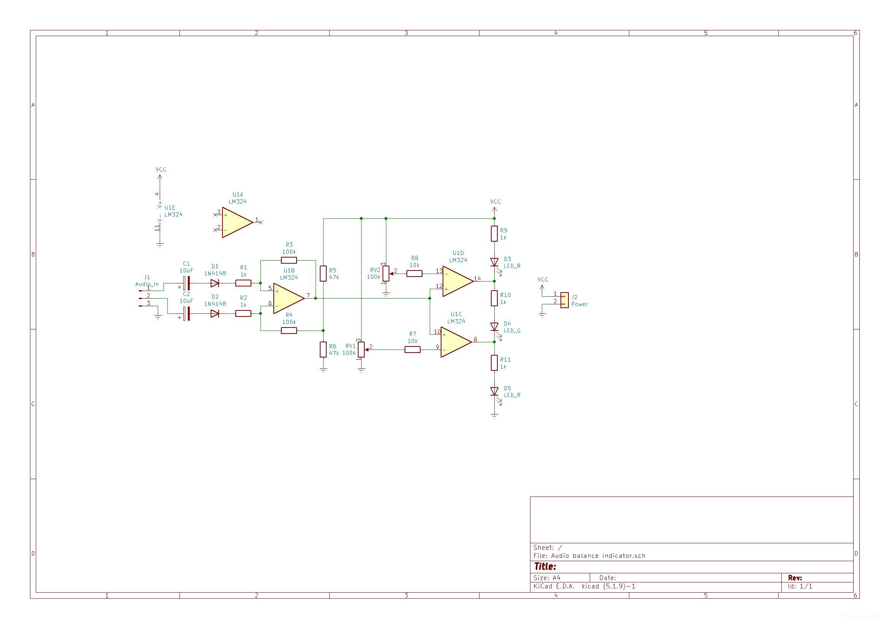

# Audio Balance Indicator

A stereo audio balance indicator that compares the relative signal levels of the left and right channels and provides a visual LED indication of channel imbalance.

The project was developed as a junior-year analog electronics project and includes the KiCad design source together with PCB manufacturing artifacts.



## Features

- Stereo left/right level comparison
- LED-based visual indication
- Adjustable response through potentiometers
- Analog signal-processing design
- KiCad schematic source
- Gerber manufacturing package

## Repository structure

```text
hardware/
  audio-balance-indicator.kicad_sch
  audio-balance-indicator.kicad_pro
manufacturing/
  gerber-files.zip
assets/
  pcb-preview.png
docs/
  project-report.pdf
```

## Documentation

- [Project report](docs/project-report.pdf)

## Open the design

1. Install KiCad.
2. Open `hardware/audio-balance-indicator.kicad_pro`.
3. Review the schematic in the Schematic Editor.
4. Use the Gerber package under `manufacturing/` when reviewing fabrication outputs.

## Tools

- KiCad
- Analog electronic components
- LED indicators
- PCB manufacturing files

## Author

Andaç Ünal
